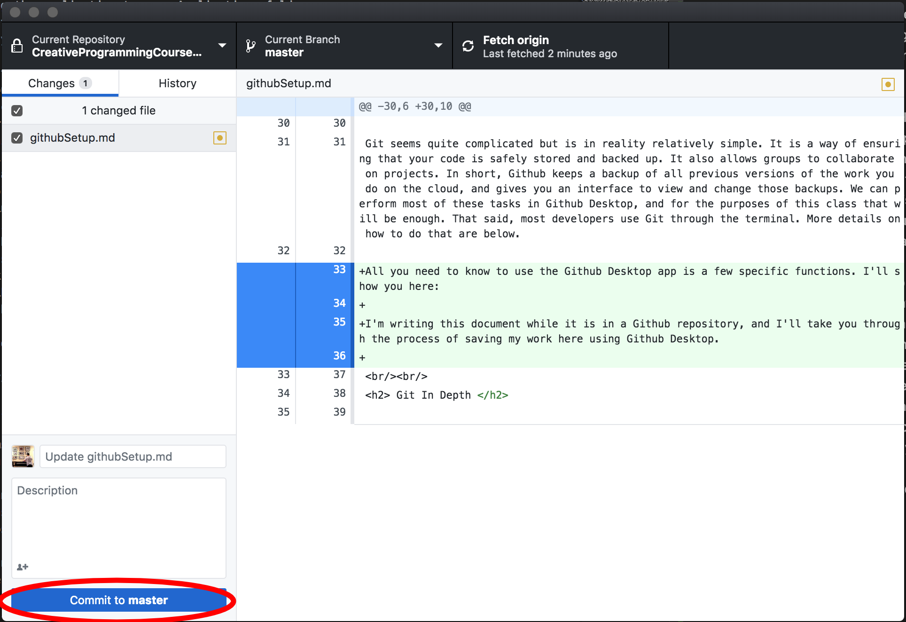
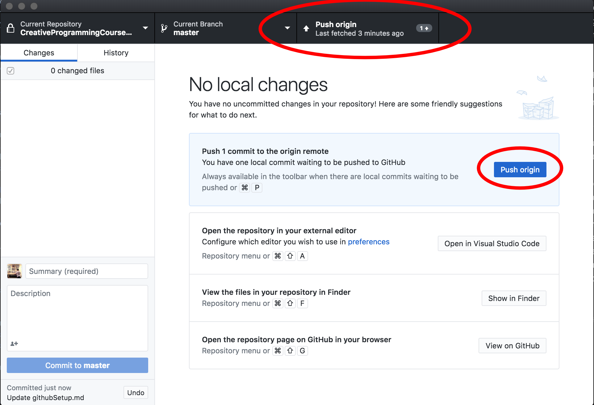
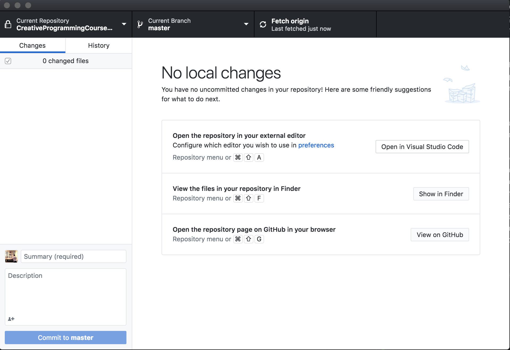

# Setting up GitHub Desktop

#### Git is a valuable tool that helps individuals and teams of programmers develop applications while ensuring that every historical change made to a project is saved. This document will guide you through the process of setting up GitHub Desktop on Mac or Windows. It will also introduce the basics of git.

## Creating a GitHub account 

1. Go to [GitHub](http://www.GitHub.com/) 
2. Put in your username, email, and password. Fill out the verification test and fill out the information about your skills and experience. 
3. When you're done, you'll get an email that should have a confirmation link. Click it to verify your email address. 
4. Navigate to your icon in the top right and then click on settings. Under Emails, uncheck "Block command line pushes that expose my email"
5. Now that your account is created, download and set up the Desktop app with the instructions below.

## Installing GitHub Desktop 

1. Download the GitHub Desktop app on their [product page](https://desktop.GitHub.com/). 
2. Go to your downloads folder on Mac or Windows and open the package you've downloaded. On Mac, drag the application to your Applications folder.
3. Open the app you've just installed, signing in to your GitHub account.
4. Once you get to the "Let's Get Started" page, click "Create a New Repository on Your Hard Drive".
5. Name this repository "GitHubTest" and give it a good description. Choose a location for it on your computer that makes sense.
6. On Mac, Click "Show in Finder" on the bottom right. Once you find the folder on your computer, make a text file using Textedit or any other editor that says "testing GitHub...". Title this file "GitHubTest.txt". 
7. You'll notice that the GitHub app now shows the file you just created. Each place that you see a `+` means that there is a line added that wasn't there before. 
8. To upload your changes to the repository, click "Commit to master" with a description explaining what changes you made. In this case, "added GitHubTest.txt" would be a great description.
9. Now there should be no changes shown on the current pane. If you move to the History pane, you'll see a list of all the changes that have been committed to this repository over time.
10. Back in the "Changes" pane, click the big blue "Publish Repository" button. Confirm that you'd like to publish to the web.
11. Now back in your browser you should see a new repository that has the same information in it as was on your computer. Now you can work on a project using GitHub. Remember to always commit to master when you've finished any stage of your project. 

## Basics of Git

Git seems quite complicated but is in reality relatively simple. It is a way of ensuring that your code is safely stored and backed up. It also allows groups to collaborate on projects. In short, Github keeps a backup of all previous versions of the work you do on the cloud, and gives you an interface to view and change those backups. We can perform most of these tasks in Github Desktop, and for the purposes of this class that will be enough. That said, most developers use Git through the terminal. More details on how to do that are below.

All you need to know to use the Github Desktop app is a few specific functions. I'll show you here.

I'm writing this document while it is in a Github repository, and I'll take you through the process of saving my work here using Github Desktop. I'll do this in only two quick steps. First, we'll hit the "Commit to Master" button:

Now we can see the "Push to Origin" button. Click either of the two of these: 

 

Now our updates are on the remote repository and our display is back to normal:

There are many other features avaliable, but we can go over those later. 

 
 

## Git In Depth 

## How Git Works

As we've mentioned, Git is a backup and collaboration tool for individuals and groups working together on software and hardware projects. GitHub is a particular platform on which a user can make use of Git features. 

Git repositories can be interacted with both via the command line and via the GitHub Desktop app, but most users become proficient with using the command line because it doesn't require you to download an extra piece of software and can be used on remote servers where you don't have access to anything but a terminal.

Git does this by recording the changes you've made to a file rather than the file itself. This is why a focus is put on the lines added and removed from a project during any commit. This system makes two things easier: First, a user can revert to any previous commit. Say your software worked well yesterday, but now it's broken. If you're simply editing a file on your computer, you have no way of looking through your past actions. With Git, you can simply use `git revert` to revert to a previous commit. Second, GitHub doesn't need to store large amounts of data to store simple changes, as it only records the differences between files as opposed to the files themselves. These differences can be read directly using `git diff`, which is useful to check the differences between files.

 

### Making a New Repository 

A new Repository (Repo) can be created by executing 
`git init` 
in the directory where you'd like your repo to be stored locally. 

On Github Desktop, the same action can be performed by clicking "Current Repository" on the top left, and then "add", and then "create new repository".

A repo can also be downloaded from github using `git clone` followed by the URL of the GitHub page you'd like to download. This differs from simply downloading the project in that the cloned repository can be edited and changed from your machine.

On Github Desktop, the same action can be perforemd by clicking "Current Repository on the top left, and then "add", and then "clone repository". This will allow you to input the URL of the GitHub repo you'd like to clone and the destination you'd like to clone it to.

 

### Logging Changes

Git has a simple feature that allows you to see the previous commits of a project. In a local GitHub repo, execute `git log` to see the log of previous commits. 

On Github Desktop, the same feature is available in the "History" pane.

 

### Updating from GitHub

The changes made by other users to a repository aren't automatically downloaded to your computer. To initiate this process, the user must run `git pull` in a git repository. 

Whenever your repository is behind the online copy in Github Desktop, a "Fetch Origin" button appears on the top right, allowing you to achieve the same functionality. 

note: `git pull` actually performs `git fetch` and then `git merge`, changing your local repository to match the copy on the web. If you'd just like to see what's new on the web copy without changing your content, simply run `git fetch`.

 

### Staging and Committing

While it might seem from using Github Desktop that committing is simply a transaction between the folder on your computer and the copy on the web, it is actually a little more complicated than that. 

Before a commit is put on the internet at all, two things happen:

* First, the changes are staged for committing. This is done with `git add`. It can either specify a certain file or all files in the directory. For instance, if you only want to commit changes to a specific folder within your repository, say "myFolder", you could run `git add myFolder`. If you instead wanted to stage all changes to commit them, you could run `git add .`, where `.` is the terminal's way of saying "this folder". This is called staging because `git add` stages changes to be committed.

* Next, the changes are committed to HEAD using `git commit`. All commits should be given a message describing why they're being made for future reference, and this is done with `git commit -m "put your message here"`. This also doesn't change anything on the web at all. It simply changes the local representation of the repository on your computer, at a location called HEAD. This is called committing because `git commit` updates your computer's tree of edits that have been performed on a repository. It is stored at .git/head.

These are the steps that the "Commit" button does on GitHub Desktop. It doesn't interact with the web at all. Instead, to change the copy on the web (aka the **remote**), we must "push".

 

### Pushing to remotes 

The web server that takes your commit and stores it in a long list of commits from various users is called a remote. To actually put your changes on the remote server, you must run `git push origin master`, or replace `master` with the branch of your choice. 

 

### Branches

One particularly useful feature of Git is the ability to make **branches** which each have a certain feature or property. For instance, if I'm working on the UI of a plugin and my friend is working on the processing inside, we can each make a branch. Then, when we're both done, we can merge these two together. Usually, when working on separate parts of a file or separate files, this merge process goes smoothly. To make a branch, you can use either the GitHub Desktop app or the command line. A project can have many branches that sometimes merge together or break apart. The central branch is called **master** and is where your commits will go if no other branch is specified. branches exist as separate until a `merge` is executed.

To make a branch, you must run `git branch` followed by the name of the new branch.

To make a branch in the Github Desktop app, simply click on "Current Branch" in the top bar and then click "new branch".

To move from one branch to another, you can run `git checkout` followed by the name of the branch. 

To checkout a branch in the Github Desktop app, click "Current Branch" and then click on the branch you'd like to checkout.

To see a list of the branches in your repository, use `git branch --list`.

To delete a branch in your repository, use `git branch -d` followed by the name of the branch to be deleted. Only do this if you know you're okay with losing the contents.

When you're done working on a branch that's separate from the master, you can merge the branch into master. First, use `git diff` followed by the source branch and then the target branch. In this case, if we wanted to merge `mybranch` to `master` we would run `git diff mybranch master`. This would show us the differences between branches, and effectively would allow us to preview the changes that our merge will make. Then, we would make sure we're at the destination branch using `git checkout`. In this case, because we're merging to `master`, we would run `git checkout master`. Then finally we can run `git merge mybranch`. Assuming there are no conflicts between branches, the merge will occur.

To merge a branch on GitHub Desktop, click "Current Branch" and then "Choose a branch to merge into...".

  

### Other Resources 

There are many great online guides to Git, from a very simple one [here](http://rogerdudler.github.io/git-guide/) to a slightly more detailed one [here](https://medium.freecodecamp.org/what-is-git-and-how-to-use-it-c341b049ae61). There is also a great [codecademy course](https://www.codecademy.com/learn/learn-git) on Git.